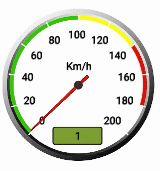
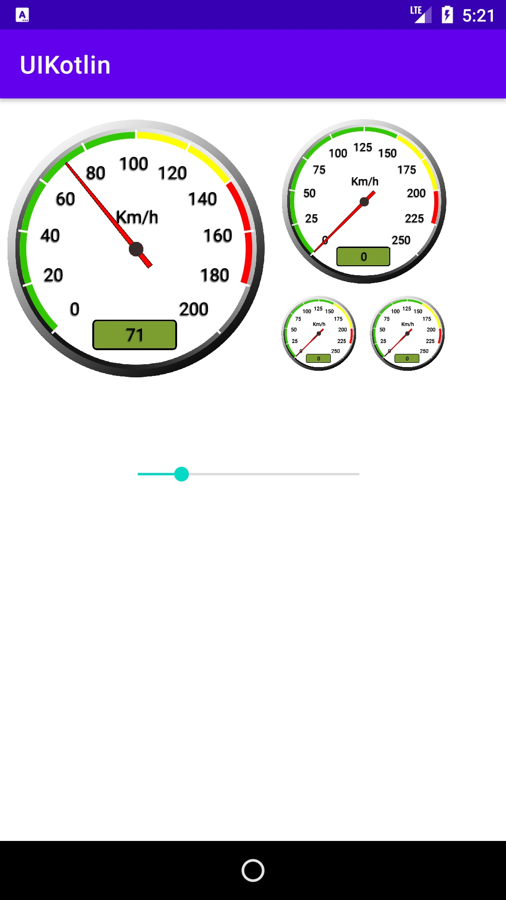
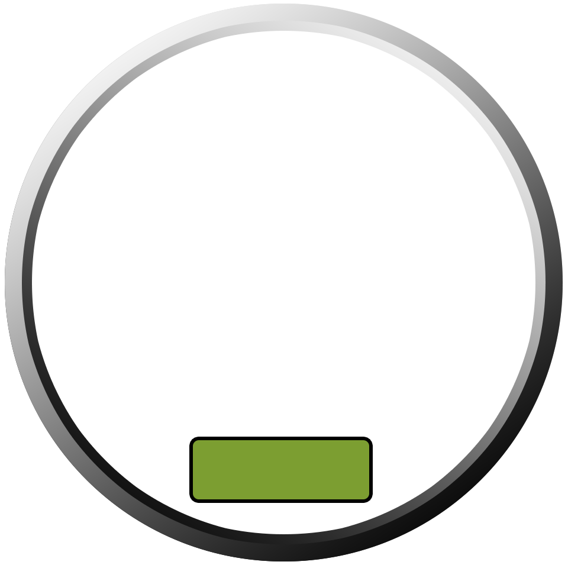
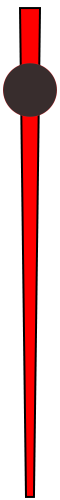

# SpeedGauge
This is a simple gauge for Android. The entire implemention has been done in Kotlin.<br>
The main Kotlin file for this view is **GaugeView.kt** plus two image assets for the **needle** and the **wheel**.

<p float="left">




</p>

## How to use it:
First, you need to add it to your layout:
```xml

<com.hjam.uikotlin.GaugeView
    android:id="@+id/gauge1"
    android:layout_width="200dp"
    android:layout_height="200dp" />

```
Then you can initialize and use it in your codes like this:
```kotlin
val gaugeView: GaugeView =findViewById(R.id.gauge1)
gaugeView.gaugeValueUnitText ="Km/h" // Gauge Unit 
gaugeView.maxValue = 200F // Maximum value
gaugeView.arcGreenMaxVal = 100F // Maximum green zone (Safe Zange)
gaugeView.arcYellowMaxVal= 140F // Maximum yellow zone (Warning Zone)
gaugeView.arcRedMaxVal = 180F // Maximum red zone (Critical Zone)
gaugeView.setGaugeVal(100F)
```
## Todo:
- Add more description.
- Add XML properties(Make it more configurable in XML layout instead of codes).

### PS
if you are a graphic designer or have any new idea or somthing in your mind please share it with me I will try to make good looking widget base on your idea.

## License
```
/*******************************************************************************
 * Copyright 2021 Hossein Jamshidi
 * Licensed under the Apache License, Version 2.0 (the "License");
 * you may not use this file except in compliance with the License.
 * You may obtain a copy of the License at
 * http://www.apache.org/licenses/LICENSE-2.0
 * Unless required by applicable law or agreed to in writing, software
 * distributed under the License is distributed on an "AS IS" BASIS,
 * WITHOUT WARRANTIES OR CONDITIONS OF ANY KIND, either express or implied.
 * See the License for the specific language governing permissions and
 * limitations under the License.
 *******************************************************************************/
 ```
